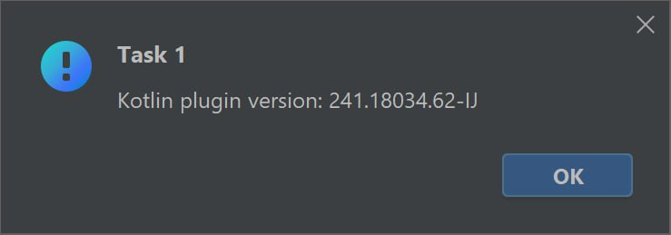
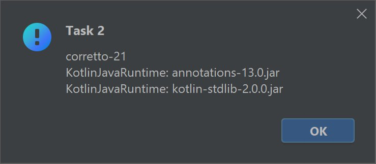
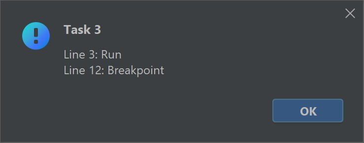
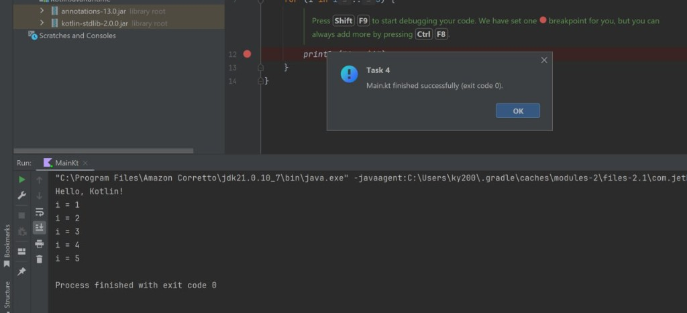

# Test Task Plugin

IntelliJ Platform plugin implementing four verification actions for a Kotlin project and a QA checklist for the JVM Console Application template.

## How to run

1. `./gradlew runIde` — launches a sandbox IDE with the plugin pre-installed.
2. In the sandbox: **New Project → Kotlin → Create**.
3. Actions are available under **Tools → Test Task Action 1 / 2 / 3 / 4**.

## Solution overview

### Task 1 — Kotlin plugin version

**What:** Displays the installed Kotlin plugin version in a dialog.



**Approach:** `PluginManagerCore.getPlugin()` with the well-known plugin ID `org.jetbrains.kotlin`.
This is the canonical way to query plugin metadata at runtime — no classpath scanning, no fragile string parsing from `about` dialogs. The plugin dependency is declared in `plugin.xml` via `<depends>`, so the Kotlin plugin is guaranteed to be present.

### Task 2 — External libraries

**What:** Lists project SDK and library JARs (mirroring the "External Libraries" node in the Project view).



**Approach:** Iterates `OrderEnumerator` per module, classifying each entry as either `JdkOrderEntry` (SDK) or `LibraryOrderEntry` (library JARs). A single pass with `when` handles both types. Results are deduplicated via sets and sorted for stable output.

I chose `OrderEnumerator` over `ProjectRootManager` because it gives direct access to individual order entries with their types, while `ProjectRootManager` only exposes aggregated root URLs without distinguishing SDK from libraries.

### Task 3 — Line markers

**What:** Opens `Main.kt` in the editor and reports all line markers (Run, Override, Implement gutter icons).



**Approach:** `DaemonCodeAnalyzerImpl.getLineMarkers()` returns `LineMarkerInfo` objects that the platform's code analysis pass produces. The key challenge here is timing — `DaemonCodeAnalyzer.restart()` triggers analysis **asynchronously**, so reading markers immediately after would either return stale data or an empty list.

The solution polls `analyzer.isRunningOrPending` at 200ms intervals (up to 10 seconds) before collecting results. This avoids blocking the EDT while still waiting for fresh data.

The output includes both `LineMarkerInfo` objects from the daemon analyzer (Run, Override, Implement icons) and `XLineBreakpoint` entries from `XDebuggerManager`. These are technically distinct platform APIs, but both are visible in the gutter and fit the task's definition of "line markers located in the editor on the left".

### Task 4 — Run and verify exit code

**What:** Programmatically runs `Main.kt` and verifies the process exits with code 0.



**Approach:** `ConfigurationContext` auto-detects (or creates) a run configuration from the PSI file, then `ProgramRunnerUtil.executeConfigurationAsync()` launches it. A `ProcessAdapter` listens for `processTerminated` and reports the exit code.

Key details:
- **Run configuration reuse.** If a matching config already exists in `RunManager`, it's selected; otherwise a temporary one is created. This matches what a user would see clicking "Run" from the gutter.
- **Thread safety.** The termination callback can race with the timeout on different threads. An `AtomicBoolean` ensures exactly one result dialog is shown.
- **Timeout.** A 60-second watchdog prevents the action from silently hanging if the process deadlocks or runs indefinitely.

### Task 5 — QA checklist

See [`CHECKLIST.md`](CHECKLIST.md).

The checklist covers 50+ scenarios across 13 categories: happy path creation, negative/edge cases (special characters, missing JDK, cancel mid-wizard), SDK compatibility matrix, build and execution, debug support, IDE features (completion, navigation, refactoring), project lifecycle (reopen, invalidate caches), cross-platform behavior, performance, and version compatibility.

### Shared utilities — `TestTaskFiles`

Actions 3 and 4 both need to locate `Main.kt` and convert it to PSI. Rather than duplicating the lookup logic, `TestTaskFiles` provides `findMainKt()` and `toPsiFile()` — both wrapped in `ReadAction` since they touch the index and PSI tree.

`findMainKt` prefers files under `/src/main/kotlin/` to avoid picking up test sources or build-generated copies if the project has multiple files named `Main.kt`.

## Tests

Run with `./gradlew test`. The suite uses `BasePlatformTestCase` (lightweight in-memory project fixture) and covers:

| Test class | What it verifies |
|---|---|
| `TestTaskFilesTest` | `findMainKt` locates the file by name, returns null when absent; `toPsiFile` resolves to Kotlin PSI |
| `TestTaskAction1Test` | Kotlin plugin is loaded in the test IDE and reports a non-blank version |
| `TestTaskAction2Test` | Fixture project has modules; `OrderEnumerator` doesn't throw on a minimal module |
| `TestTaskAction3Test` | `doHighlighting()` produces line markers on `fun main()`; marker offsets are within document bounds |

Tests use `configureByText` (in-memory files) instead of test data directories to keep the setup minimal and avoid VFS root access issues with the Kotlin plugin's initialization.

## Project structure

```
src/main/kotlin/org/jetbrains/
├── TestTaskAction1.kt    — Kotlin plugin version
├── TestTaskAction2.kt    — external libraries
├── TestTaskAction3.kt    — line markers
├── TestTaskAction4.kt    — run and verify exit code
└── TestTaskFiles.kt      — shared lookup utilities

src/test/kotlin/org/jetbrains/
├── TestTaskAction1Test.kt
├── TestTaskAction2Test.kt
├── TestTaskAction3Test.kt
└── TestTaskFilesTest.kt

CHECKLIST.md              — QA checklist for Task 5
```
